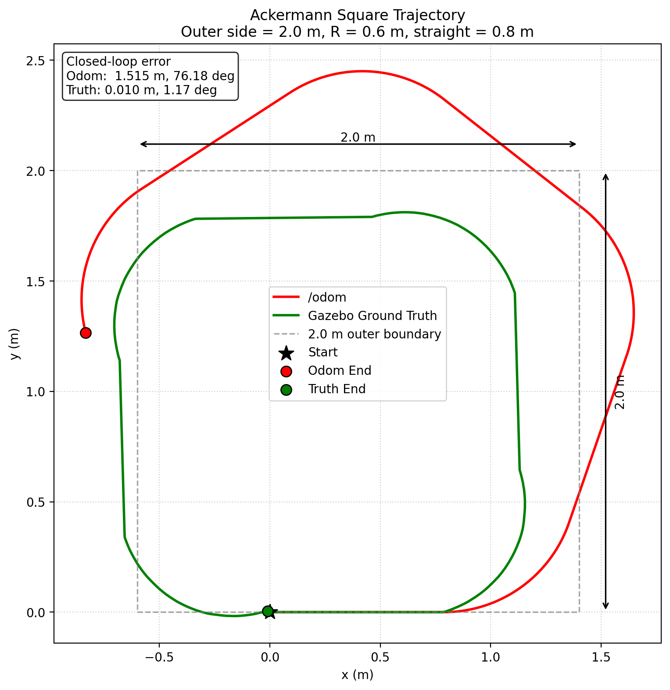

# M3-1 ｜ 坐标系与里程计：先搞清楚“我在哪”

本项目基于 **ROS 2 Humble + Gazebo Classic**，使用题目提供的 Ackermann 小车模型完成：

- `smart_car_description` ROS 2 包搭建
- Gazebo 最小仿真世界
- Ackermann 小车 2 m 圆角正方形闭环运动
- `/odom` 轮式里程计采集
- `/gazebo/model_states` Gazebo Ground Truth 采集
- 10 次闭环重复实验
- 闭环位置与角度误差 `mean ± std`
- Odometry / Ground Truth 轨迹对比
- TF Tree 验证
- 里程计漂移来源分析

---

# 1. 实验环境

实验环境：

```text
Ubuntu 22.04
ROS 2 Humble
Gazebo Classic 11
gazebo_ros2_control
ackermann_steering_controller
Python 3
```

工作空间：

```bash
~/22SmartCar/M3/M3-1/m3_ws
```

---

# 2. 项目结构

主要目录如下：

```text
m3_ws/
├── src/
│   └── smart_car_description/
│       ├── config/
│       │   └── ackermann_controllers.yaml
│       ├── launch/
│       │   └── sim.launch.py
│       ├── urdf/
│       │   └── smart_car.urdf.xacro
│       ├── worlds/
│       │   └── square.world
│       ├── package.xml
│       └── CMakeLists.txt
│
├── scripts/
│   ├── square_driver.py
│   ├── record_traj.py
│   ├── analyze_run.py
│   ├── analyze_10laps.py
│   └── plot_trajectory.py
│
├── logs/
│   ├── run_01_odom.csv
│   ├── run_01_truth.csv
│   ├── ...
│   ├── run_10_odom.csv
│   └── run_10_truth.csv
│
├── results/
│   ├── closed_loop_stats.md
│   ├── trajectory_compare.png
│   └── tf_tree.pdf
│
├── data/
│   └── final_10laps/
│       ├── run_01_odom.csv
│       ├── run_01_truth.csv
│       ├── ...
│       ├── run_10_odom.csv
│       ├── run_10_truth.csv
│       └── summary.csv
│
├── plots/
│   ├── trajectory_compare.png
│   ├── frames.dot
│   ├── frames.png
│   └── frames.pdf
│
└── README.md
```

其中：

```text
logs/
results/
```

是最终交付目录。

`data/` 与 `plots/` 保留实验过程中的原始分析结果。

---

# 3. 创建 smart_car_description 包

题目提供：

```text
smart_car.urdf.xacro
ackermann_controllers.yaml
```

但它们本身还不是一个可以直接运行的 ROS 2 package。

因此本实验创建：

```text
smart_car_description
```

并补充：

```text
package.xml
CMakeLists.txt
launch/sim.launch.py
worlds/square.world
```

使：

```text
$(find smart_car_description)/config/ackermann_controllers.yaml
```

能够正确找到控制器配置文件。

题目提供的：

```text
smart_car.urdf.xacro
ackermann_controllers.yaml
```

中的车辆和控制参数保持不变。

---

# 4. 编译

进入工作空间：

```bash
cd ~/22SmartCar/M3/M3-1/m3_ws
```

加载 ROS 2：

```bash
source /opt/ros/humble/setup.bash
```

编译：

```bash
colcon build --symlink-install
```

加载当前工作空间：

```bash
source install/setup.bash
```

最终验证：

```text
Summary: 1 package finished
```

说明 package 可以正常编译。

---

# 5. 启动 Gazebo

使用终端 A：

```bash
cd ~/22SmartCar/M3/M3-1/m3_ws

source /opt/ros/humble/setup.bash
source install/setup.bash

ros2 launch smart_car_description sim.launch.py
```

启动后包括：

```text
Gazebo Classic
robot_state_publisher
gazebo_ros2_control
joint_state_broadcaster
ackermann_steering_controller
```

检查控制器：

```bash
ros2 control list_controllers
```

正常情况下可以看到：

```text
joint_state_broadcaster        active
ackermann_steering_controller  active
```

车辆速度控制话题：

```text
/cmd_vel
```

消息类型：

```text
geometry_msgs/msg/Twist
```

---

# 6. Gazebo 世界

本实验创建最小仿真世界：

```text
src/smart_car_description/worlds/square.world
```

世界主要包含：

```text
ground_plane
sun
Gazebo ROS state plugin
```

Gazebo ROS state plugin 用于提供：

```text
/gazebo/model_states
```

作为仿真 Ground Truth。

---

# 7. 车辆关键几何参数

根据题目提供的小车模型：

```text
wheelbase = 0.28 m
wheel radius = 0.05 m
maximum steering angle = ±30 deg
```

理论最小转弯半径：

```text
R_min = wheelbase / tan(30 deg)
```

即：

```text
R_min
    = 0.28 / tan(30 deg)
    ≈ 0.485 m
```

约为：

```text
0.49 m
```

因此车辆不能像差速小车一样：

```text
到达正方形顶点
-> 原地旋转 90 deg
-> 再继续直行
```

必须使用满足 Ackermann 几何约束的连续转向路径。

---

# 8. 2 m 正方形转角方案

本实验选择：

```text
直线 + 四分之一圆弧
```

构成圆角正方形。

`--side 2.0` 在本实现中表示：

```text
圆角正方形外包络尺寸 = 2.0 m × 2.0 m
```

而不是每一段直线单独长 2 m。

使用转弯半径：

```text
R = 0.6 m
```

满足：

```text
R > R_min ≈ 0.49 m
```

因此能够满足车辆最大转向角约束。

---

# 9. 直线段长度计算

正方形外包络边长：

```text
S = 2.0 m
```

每个角由半径：

```text
R = 0.6 m
```

的 90° 四分之一圆弧完成。

因此一条边中间的直线段长度为：

```text
L = S - 2R
```

代入：

```text
L
    = 2.0 - 2 × 0.6
    = 0.8 m
```

所以一圈路径由四组：

```text
0.8 m 直线
+
90° 圆弧
```

组成。

整体外包络仍然为：

```text
2.0 m × 2.0 m
```

---

# 10. 直线运动时间

实验线速度：

```text
v = 0.2 m/s
```

直线长度：

```text
L = 0.8 m
```

因此理论直线时间：

```text
t_straight = L / v
```

得到：

```text
t_straight
    = 0.8 / 0.2
    = 4.0 s
```

---

# 11. 转弯角速度

使用：

```text
R = 0.6 m
v = 0.2 m/s
```

根据：

```text
omega = v / R
```

得到：

```text
omega
    = 0.2 / 0.6
    ≈ 0.333 rad/s
```

---

# 12. 理论 90° 转弯时间

90° 对应：

```text
theta = pi / 2
```

因此理论转弯时间：

```text
t_turn = theta / omega
```

即：

```text
t_turn
    = (pi / 2) / 0.333
    ≈ 4.712 s
```

---

# 13. 转弯时间实测标定

实际 Gazebo 测试发现：

```text
v = 0.2 m/s
R = 0.6 m
理论转弯时间 = 4.712 s
```

时，车辆真实航向变化明显超过 90°。

因此先使用理论值，再进行单独的转弯实验微调。

最终测得：

```text
约 3.93 s
```

时，Gazebo Ground Truth 航向变化接近：

```text
90 deg
```

因此定义：

```text
TURN_TIME_SCALE = 0.834
```

因为：

```text
3.93 / 4.712 ≈ 0.834
```

程序实际使用：

```text
calibrated_turn_time
    = theoretical_turn_time × TURN_TIME_SCALE
```

即：

```text
4.712 × 0.834
≈ 3.93 s
```

这不是直接“凭感觉”设定转弯时间，而是：

```text
理论计算
-> 单独实验
-> 根据 Ground Truth 测量实际转角
-> 得到修正系数
```

---

# 14. 运行一圈

保持终端 A Gazebo 正常运行。

终端 B：

```bash
cd ~/22SmartCar/M3/M3-1/m3_ws

source /opt/ros/humble/setup.bash
source install/setup.bash

python3 scripts/square_driver.py \
  --laps 1 \
  --side 2.0 \
  --speed 0.2 \
  --turn-radius 0.6 \
  --out logs
```

其中：

```text
--laps
```

控制重复次数，

```text
--side
```

控制正方形外包络边长，

```text
--out
```

控制输出目录。

这些参数均没有写死在程序内部。

---

# 15. 正式运行 10 次

重新启动干净的 Gazebo 后：

```bash
cd ~/22SmartCar/M3/M3-1/m3_ws

source /opt/ros/humble/setup.bash
source install/setup.bash

python3 scripts/square_driver.py \
  --laps 10 \
  --side 2.0 \
  --speed 0.2 \
  --turn-radius 0.6 \
  --out logs
```

每圈自动完成：

```text
reset world
    ↓
等待车辆稳定
    ↓
启动 record_traj.py
    ↓
等待 /odom
    ↓
等待 /gazebo/model_states 中 smart_car 真值
    ↓
Recorder ready
    ↓
开始当前圈
    ↓
4 ×（直线 + 90° 圆弧）
    ↓
停车
    ↓
保存 CSV
```

无需手动逐圈控制。

---

# 16. 为什么使用 /reset_world

实验测试过：

```text
/reset_simulation
```

但它会使：

```text
/clock
```

跳回 0。

这会影响持续运行中的：

```text
ros2_control
trajectory recorder
```

因此多圈实验使用：

```text
/reset_world
```

它可以恢复 Gazebo 中车辆的真实物理位姿，同时保持：

```text
/clock
```

继续向前运行。

---

# 17. /reset_world 不会清零 odom

实验中观察到：

```text
/reset_world
```

会把 Gazebo 中车辆恢复到初始位置，但：

```text
/odom
```

不会一起归零。

因此第 2、3、4 圈之后的 `/odom` 起点绝对数值不一定是：

```text
x = 0
y = 0
theta = 0
```

所以闭环误差不能直接使用：

```text
sqrt(x_end^2 + y_end^2)
```

而必须对每一圈使用自己的起点与终点：

```text
dx = x_end - x_start
dy = y_end - y_start
```

这样可以正确计算每一圈内部的闭环偏差。

---

# 18. 数据采集

`scripts/record_traj.py` 同时订阅：

```text
/odom
/gazebo/model_states
```

其中：

```text
/odom
```

为 Ackermann controller 根据车辆运动学模型推算得到的里程计。

```text
/gazebo/model_states
```

为 Gazebo 仿真中的真实物理位姿，用作 Ground Truth。

Ground Truth 只用于：

```text
对照
误差计算
转弯标定
```

没有使用 `/gazebo/model_states` 对 `/odom` 进行任何在线修正。

---

# 19. CSV 格式

每一圈保存：

```text
run_XX_odom.csv
run_XX_truth.csv
```

统一表头：

```text
t,x,y,theta
```

例如：

```text
t,x,y,theta
0.000000,0.000000000,0.000000000,0.000000000
...
```

其中：

```text
t
```

单位为秒。

```text
x, y
```

单位为米。

```text
theta
```

单位为弧度。

角度由四元数转换为 yaw，范围为：

```text
[-pi, pi]
```

---

# 20. 仿真时间

轨迹记录节点设置：

```text
use_sim_time = True
```

并使用：

```python
self.get_clock().now()
```

记录时间。

因此 CSV 中：

```text
t
```

来源于 Gazebo 发布的：

```text
/clock
```

而不是计算机系统时间。

---

# 21. Recorder 同步

早期测试中，如果只在启动 recorder 后固定等待：

```text
1 second
```

存在 Ground Truth 尚未找到：

```text
smart_car
```

而车辆已经开始运动的风险。

因此最终程序增加 recorder ready 同步机制。

流程：

```text
record_traj.py 启动
        ↓
成功收到 /odom
        ↓
成功从 /gazebo/model_states 找到 smart_car
        ↓
创建 ready 标志
        ↓
square_driver.py 检测 ready
        ↓
车辆才开始运动
```

这样可以保证：

```text
odom CSV
truth CSV
```

均从车辆开始运动前就已经进入有效记录状态。

---

# 22. 坐标系约定

本实验主要使用以下坐标系。

| Frame | 含义 |
|---|---|
| `map` | 全局地图坐标系，用于表示全局一致的位置 |
| `odom` | 局部里程计坐标系，运动连续，但允许长期累计漂移 |
| `base_footprint` | 车辆在地面上的二维参考 frame，本车里程计的 child frame |
| `base_link` | 车辆本体坐标系，是传感器和车辆 link 的主要父 frame |
| `lidar_link` | 激光雷达自身坐标系 |
| `camera_link` | RGB 相机自身坐标系 |

---

# 23. map 坐标系

`map` 表示：

```text
全局一致的世界 / 地图坐标系
```

它通常来自：

```text
SLAM
定位系统
```

与 `odom` 最大区别是：

```text
map:
强调长期全局一致性

odom:
强调局部运动连续性
允许长期漂移
```

M3-1 中没有运行 SLAM，因此当前 TF Tree 中：

```text
没有 map frame
```

---

# 24. odom 坐标系

`odom` 是轮式里程计使用的局部参考坐标系。

特点：

```text
短时间连续
不应该突然跳变
但允许随着时间累计漂移
```

本实验的主要目标之一，就是比较：

```text
odom 推算结果
```

和：

```text
Gazebo Ground Truth
```

来量化这种漂移。

---

# 25. base_footprint 与 base_link

本车辆实际 TF 主链不是直接：

```text
odom -> base_link
```

而是：

```text
odom
  ↓
base_footprint
  ↓
base_link
```

其中：

```text
base_footprint
```

作为车辆在地面平面上的参考 frame。

而：

```text
base_link
```

代表车辆本体。

固定关系为：

```text
base_footprint -> base_link

x = 0
y = 0
z = 0.05 m
```

---

# 26. lidar_link

`lidar_link` 为激光雷达坐标系。

TF：

```text
base_link -> lidar_link
```

为固定变换：

```text
x = 0
y = 0
z = 0.085 m
```

因此雷达始终固定安装在车体上。

---

# 27. camera_link

相机 TF：

```text
base_link -> camera_link
```

为固定变换：

```text
x = 0.22 m
y = 0
z = 0.12 m
```

相机还具有：

```text
camera_optical_link
```

用于符合相机 optical frame 坐标约定。

---

# 28. /odom 信息

控制器配置中的里程计参数：

```text
publish_rate: 50.0
enable_odom_tf: true

base_frame_id: base_footprint
odom_frame_id: odom
```

因此：

```text
/odom
```

配置发布频率为：

```text
50 Hz
```

对应 frame：

```text
header.frame_id = odom
child_frame_id  = base_footprint
```

同时由于：

```text
enable_odom_tf = true
```

控制器还发布：

```text
odom -> base_footprint
```

动态 TF。

使用 `view_frames` 实测：

```text
rate ≈ 50.2 Hz
```

与配置中的：

```text
50 Hz
```

一致。

---

# 29. TF Tree

实际测得主要 TF Tree：

```text
odom
└── base_footprint
    └── base_link
        ├── lidar_link
        ├── camera_link
        │   └── camera_optical_link
        ├── front_left_steering_link
        │   └── front_left_wheel
        ├── front_right_steering_link
        │   └── front_right_wheel
        ├── rear_left_wheel
        └── rear_right_wheel
```

---

# 30. TF 发布来源

主要变换如下。

| Transform | 类型 | 发布者 | 物理含义 |
|---|---|---|---|
| `odom -> base_footprint` | 动态 | Ackermann controller | 车辆里程计估计位姿 |
| `base_footprint -> base_link` | 静态 | `robot_state_publisher` | 地面参考 frame 到车体 frame |
| `base_link -> lidar_link` | 静态 | `robot_state_publisher` | 雷达安装位置 |
| `base_link -> camera_link` | 静态 | `robot_state_publisher` | 相机安装位置 |
| `base_link -> steering/wheel links` | 动态 | `robot_state_publisher` 根据 joint states 发布 | 转向角和车轮运动 |
| `map -> odom` | M3-1 中不存在 | — | 后续由 SLAM / localization 提供全局修正 |

其中实际动态 joint TF 频率约为：

```text
30 Hz
```

---

# 31. M3-1 中 map -> odom 是否存在？

结论：

```text
不存在
```

M3-1 中没有运行：

```text
SLAM
AMCL
其他全局定位节点
```

因此没有节点负责发布：

```text
map -> odom
```

当前 TF 从：

```text
odom
```

开始。

---

# 32. map -> odom 应该由谁发布？

在后续 SLAM / localization 系统中，通常由：

```text
SLAM 节点
或
定位节点
```

计算和发布：

```text
map -> odom
```

其整体逻辑可以理解为：

```text
map
 ↓
odom
 ↓
base_footprint
 ↓
base_link
```

其中：

```text
odom -> base_footprint
```

提供连续的局部运动估计。

而：

```text
map -> odom
```

负责对长期累计的里程计漂移进行全局修正。

因此：

```text
odom
```

允许漂移，

而：

```text
map
```

用于保持长期全局一致。

本实验的 `/gazebo/model_states` 没有参与发布：

```text
map -> odom
```

也没有被用于修正任何 TF。

---

# 33. TF 验证

检查 TF topic：

```bash
ros2 topic list | grep -E '^/tf$|^/tf_static$'
```

检查：

```text
odom -> base_footprint
```

```bash
ros2 run tf2_ros tf2_echo odom base_footprint
```

检查：

```text
base_footprint -> base_link
```

```bash
ros2 run tf2_ros tf2_echo base_footprint base_link
```

检查：

```text
base_link -> lidar_link
```

```bash
ros2 run tf2_ros tf2_echo base_link lidar_link
```

检查：

```text
base_link -> camera_link
```

```bash
ros2 run tf2_ros tf2_echo base_link camera_link
```

---

# 34. TF Tree 图

最终 TF Tree：

```text
results/tf_tree.pdf
```

原始绘图文件：

```text
plots/frames.dot
```

同时保留 PNG 预览：

```text
plots/frames.png
```

TF 图中已经标出：

```text
动态 / 静态
发布频率
主要物理关系
```

---

# 35. 闭环位置误差

对于每一圈：

```text
start = (x_start, y_start)
end   = (x_end, y_end)
```

定义：

```text
dx = x_end - x_start
dy = y_end - y_start
```

位置偏差：

```text
e_position = sqrt(dx^2 + dy^2)
```

即：

```text
e_position
    =
    sqrt(
        (x_end - x_start)^2
        +
        (y_end - y_start)^2
    )
```

---

# 36. 闭环角度误差

首先计算：

```text
dtheta = theta_end - theta_start
```

由于角度具有：

```text
-pi / +pi
```

边界，所以不能直接使用普通减法结果。

程序通过：

```python
atan2(
    sin(dtheta),
    cos(dtheta)
)
```

将角度归一化到：

```text
(-pi, pi]
```

然后按照题目要求计算：

```text
heading_error
    =
    |normalize(theta_end - theta_start)|
```

也就是最终报告的角度误差始终为：

```text
非负值
```

---

# 37. 10 次统计方法

执行：

```bash
python3 scripts/analyze_10laps.py \
  --dir logs
```

程序分别计算：

```text
Odometry
Gazebo Ground Truth
```

每一圈的：

```text
position error
heading error
```

然后统计：

```text
mean ± standard deviation
```

标准差使用：

```text
sample standard deviation
```

即：

```text
N - 1
```

对应 Python：

```python
statistics.stdev()
```

---

# 38. 10 次 Odometry 结果

| Run | Position Error (m) | Heading Error (deg) |
|---:|---:|---:|
| 01 | 1.5152 | 76.18 |
| 02 | 1.4856 | 75.34 |
| 03 | 1.4805 | 74.16 |
| 04 | 1.4666 | 74.12 |
| 05 | 1.4821 | 74.32 |
| 06 | 1.4685 | 74.59 |
| 07 | 1.4787 | 74.43 |
| 08 | 1.4789 | 74.36 |
| 09 | 1.5215 | 76.75 |
| 10 | 1.4828 | 74.96 |
| **Mean ± Std** | **1.4861 ± 0.0181** | **74.92 ± 0.90** |

所以：

```text
Odometry position error:
1.4861 ± 0.0181 m
```

```text
Odometry heading error:
74.92 ± 0.90 deg
```

---

# 39. 10 次 Gazebo Ground Truth 结果

| Run | Position Error (m) | Heading Error (deg) |
|---:|---:|---:|
| 01 | 0.0103 | 1.17 |
| 02 | 0.0133 | 0.51 |
| 03 | 0.0194 | 2.92 |
| 04 | 0.0344 | 3.05 |
| 05 | 0.0151 | 1.61 |
| 06 | 0.0514 | 2.08 |
| 07 | 0.0768 | 1.54 |
| 08 | 0.0143 | 0.30 |
| 09 | 0.0369 | 2.71 |
| 10 | 0.0177 | 0.84 |
| **Mean ± Std** | **0.0290 ± 0.0214** | **1.67 ± 0.99** |

所以：

```text
Ground Truth position error:
0.0290 ± 0.0214 m
```

```text
Ground Truth heading error:
1.67 ± 0.99 deg
```

车辆真实闭环位置平均误差约：

```text
2.9 cm
```

---

# 40. 系统误差与随机误差分析

Odometry 的位置误差：

```text
1.4861 ± 0.0181 m
```

其中：

```text
mean = 1.4861 m
std  = 0.0181 m
```

平均值非常大，而标准差相对于平均值很小。

角度误差同样为：

```text
74.92 ± 0.90 deg
```

10 次实验结果非常集中。

因此 `/odom` 的主要误差表现为：

```text
系统性误差
```

而不是完全随机的漂移。

---

# 41. 可能的系统误差来源

可能来源包括：

```text
Ackermann 转向几何模型
控制器内部运动学模型
Gazebo 中实际车辆轮胎运动
轮胎与地面接触
转向角实际响应
航向角积分
```

之间存在差异。

特别是在 Ackermann 转弯过程中：

```text
heading error
```

如果存在稳定偏差，就会在位置积分中继续传播。

车辆位置通常依赖类似：

```text
dx ~ v cos(theta) dt
dy ~ v sin(theta) dt
```

的积分。

因此航向角一旦持续错误：

```text
theta error
    ↓
x / y integration error
    ↓
position drift
```

最终就会产生很大的闭环位置误差。

---

# 42. 随机误差

Ground Truth：

```text
0.0290 ± 0.0214 m
```

平均值很小，但相对于自身均值而言，10 次之间存在一定波动。

例如最大一次位置闭环偏差约：

```text
0.0768 m
```

这类波动可能来自：

```text
轮胎与地面接触
轻微滑动
Gazebo 物理求解
控制时序
```

等因素。

因此 Ground Truth 闭环误差中具有一定：

```text
随机误差成分
```

但其绝对量级仍显著小于 `/odom` 的系统性漂移。

---

# 43. 轨迹图

最终轨迹对比图：

```text
results/trajectory_compare.png
```



图中：

```text
红线 = /odom
绿线 = /gazebo/model_states Ground Truth
```

并标出了：

```text
Start
Odom End
Truth End
```

以及当前单圈：

```text
位置闭环偏差
角度闭环偏差
```

---

# 44. 为什么轨迹先转换到局部起始坐标系？

由于：

```text
/reset_world
```

不会清零 `/odom`，所以不同圈 `/odom` 的绝对起始坐标可能不同。

为了公平比较轨迹形状，绘图时分别将轨迹转换到自身起始 frame：

```text
起点 -> (0, 0)
初始航向 -> 0
```

先平移：

```text
dx = x - x0
dy = y - y0
```

再根据初始 yaw 旋转：

```text
x_local
    = cos(theta0) dx
    + sin(theta0) dy

y_local
    = -sin(theta0) dx
    + cos(theta0) dy
```

这个操作只用于：

```text
绘图坐标统一
```

没有修改原始 CSV，也没有用于修改 odometry。

---

# 45. 轨迹图中的 2 m

轨迹图中的灰色虚线框表示：

```text
2.0 m × 2.0 m
```

圆角正方形外包络。

当前：

```text
side = 2.0 m
R = 0.6 m
```

因此：

```text
straight = 0.8 m
```

图中同时使用水平和垂直尺寸箭头明确标出了：

```text
2.0 m
```

坐标轴设置：

```text
equal aspect ratio
```

因此 x、y 两个方向具有相同尺度，不会人为把正方形拉伸成长方形。

---

# 46. 第 1 圈轨迹结果

最终图中第 1 圈闭环误差：

```text
Odom:
1.515 m
76.18 deg
```

Ground Truth：

```text
0.010 m
1.17 deg
```

可以明显看到：

```text
真实车辆基本闭合
```

但：

```text
Odometry 明显向外漂移
```

与 10 次统计中的系统误差结论一致。

---

# 47. 绘制轨迹图

由于当前系统 Python 环境存在：

```text
NumPy 2.x
```

与系统 Matplotlib 二进制包的兼容问题，因此绘图使用独立 virtual environment。

首次创建：

```bash
sudo apt install -y python3.10-venv
```

然后：

```bash
cd ~/22SmartCar/M3/M3-1/m3_ws

python3 -m venv .plot_venv

.plot_venv/bin/python -m pip install --upgrade pip

.plot_venv/bin/python -m pip install "numpy<2" matplotlib
```

生成轨迹图：

```bash
.plot_venv/bin/python scripts/plot_trajectory.py \
  --odom logs/run_01_odom.csv \
  --truth logs/run_01_truth.csv \
  --side 2.0 \
  --turn-radius 0.6 \
  --out results/trajectory_compare.png
```

---

# 48. 闭环统计文件

正式统计结果：

```text
results/closed_loop_stats.md
```

原始机器可读统计结果还保存在：

```text
data/final_10laps/summary.csv
```

---

# 49. 最终交付物

主要交付文件：

```text
logs/
├── run_01_odom.csv
├── run_01_truth.csv
├── run_02_odom.csv
├── run_02_truth.csv
├── ...
├── run_10_odom.csv
└── run_10_truth.csv
```

以及：

```text
results/
├── closed_loop_stats.md
├── trajectory_compare.png
└── tf_tree.pdf
```

---

# 50. 一键复现流程

## 终端 A：启动仿真

```bash
cd ~/22SmartCar/M3/M3-1/m3_ws

source /opt/ros/humble/setup.bash
source install/setup.bash

ros2 launch smart_car_description sim.launch.py
```

## 终端 B：运行 10 次

```bash
cd ~/22SmartCar/M3/M3-1/m3_ws

source /opt/ros/humble/setup.bash
source install/setup.bash

python3 scripts/square_driver.py \
  --laps 10 \
  --side 2.0 \
  --speed 0.2 \
  --turn-radius 0.6 \
  --out logs
```

## 统计

```bash
python3 scripts/analyze_10laps.py \
  --dir logs
```

## 绘图

```bash
.plot_venv/bin/python scripts/plot_trajectory.py \
  --odom logs/run_01_odom.csv \
  --truth logs/run_01_truth.csv \
  --side 2.0 \
  --turn-radius 0.6 \
  --out results/trajectory_compare.png
```

---

# 51. 现场演示建议

现场演示时可以使用两个终端。

终端 A：

```bash
source /opt/ros/humble/setup.bash
source install/setup.bash

ros2 launch smart_car_description sim.launch.py
```

终端 B：

```bash
source /opt/ros/humble/setup.bash
source install/setup.bash

python3 scripts/square_driver.py \
  --laps 1 \
  --side 2.0 \
  --speed 0.2 \
  --turn-radius 0.6 \
  --out logs/demo
```

可以同时检查：

```bash
ros2 topic echo /odom --once
```

以及：

```bash
ros2 topic hz /odom
```

---

# 52. 实验结论

本实验完成了 ROS 2 + Gazebo 中 Ackermann 小车的坐标系与轮式里程计实验。

由于 Ackermann 小车不能原地旋转，因此没有使用：

```text
直线
-> 原地旋转 90°
```

而是采用：

```text
直线
+
90° 四分之一圆弧
```

完成：

```text
2.0 m × 2.0 m
```

外包络圆角正方形。

当前路径参数为：

```text
side = 2.0 m
turn radius = 0.6 m
straight length = 0.8 m
speed = 0.2 m/s
```

理论转弯时间为：

```text
4.712 s
```

通过 Ground Truth 单独标定后使用：

```text
TURN_TIME_SCALE = 0.834
```

实际转弯时间约：

```text
3.93 s
```

10 次实验得到 Ground Truth：

```text
Position error:
0.0290 ± 0.0214 m

Heading error:
1.67 ± 0.99 deg
```

说明车辆真实运动能够较稳定地完成闭环。

而 Odometry 为：

```text
Position error:
1.4861 ± 0.0181 m

Heading error:
74.92 ± 0.90 deg
```

Odometry 的平均误差很大，同时标准差很小，表明其主要表现为稳定的：

```text
系统性误差
```

而不是单纯随机滑动造成的漂移。

轨迹图进一步显示：

```text
Gazebo Ground Truth 基本回到起点
```

而：

```text
/odom 在多次转弯后产生明显位置与航向累计误差
```

这说明轮式里程计虽然具有良好的局部连续性，但无法保证长期全局准确。

当前 M3-1 中不存在：

```text
map -> odom
```

因此没有全局定位系统对这种漂移进行修正。

后续 SLAM / localization 的作用之一，就是建立：

```text
map -> odom
```

使：

```text
odom
```

提供连续局部运动，

而：

```text
map
```

提供长期全局一致的车辆位置。