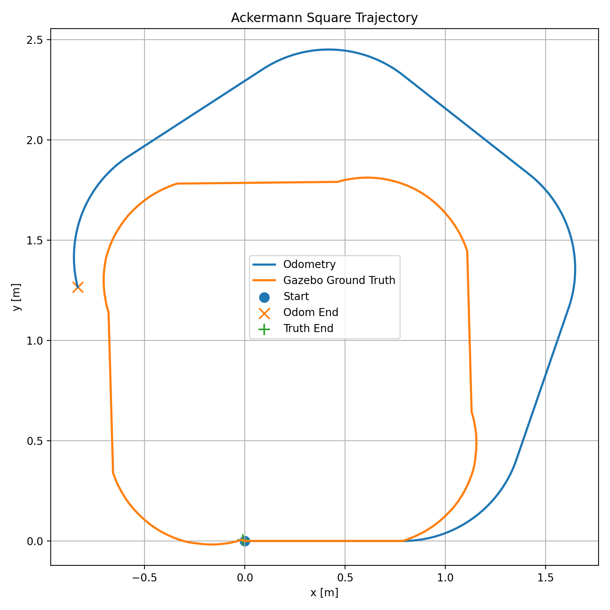
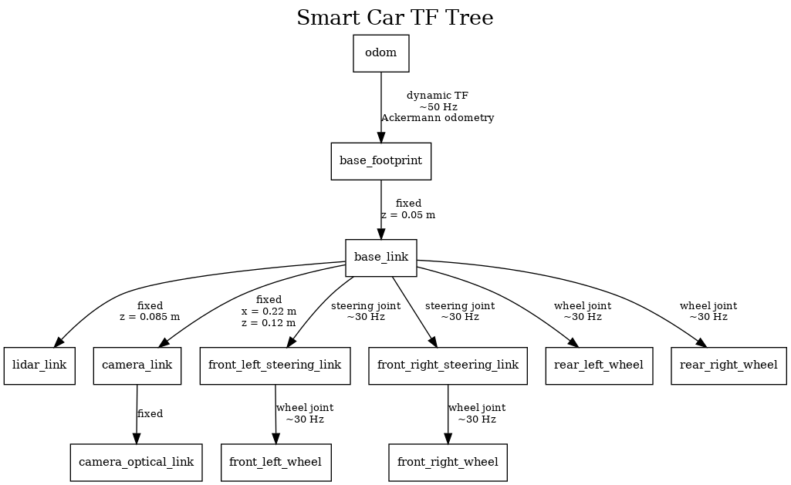

# M3-1 坐标系与里程计

本项目基于 **ROS 2 Humble + Gazebo Classic**，使用 Ackermann 转向智能小车完成：

- Gazebo 仿真环境搭建
- Ackermann 小车闭环方形轨迹控制
- `/odom` 里程计数据记录
- `/gazebo/model_states` Ground Truth 数据记录
- 10 次重复实验
- 闭环位置误差和航向误差统计
- Odometry 与 Ground Truth 轨迹对比
- TF Tree 检查与说明

---

# 1. 实验环境

本实验使用：

- Ubuntu 22.04
- ROS 2 Humble
- Gazebo Classic 11
- `gazebo_ros2_control`
- `ackermann_steering_controller`
- Python 3

工作空间：

```bash
~/22SmartCar/M3/M3-1/m3_ws
```

---

# 2. 项目目录

主要目录结构如下：

```text
m3_ws/
├── src/
│   └── smart_car_description/
│       ├── config/
│       │   └── ackermann_controllers.yaml
│       ├── launch/
│       │   └── sim.launch.py
│       ├── urdf/
│       │   └── smart_car.urdf.xacro
│       ├── worlds/
│       │   └── square.world
│       ├── CMakeLists.txt
│       └── package.xml
│
├── scripts/
│   ├── square_driver.py
│   ├── record_traj.py
│   ├── analyze_run.py
│   ├── analyze_10laps.py
│   └── plot_trajectory.py
│
├── data/
│   └── final_10laps/
│       ├── run_01_odom.csv
│       ├── run_01_truth.csv
│       ├── ...
│       ├── run_10_odom.csv
│       ├── run_10_truth.csv
│       └── summary.csv
│
├── plots/
│   ├── trajectory_run_01.png
│   ├── frames.dot
│   ├── frames.png
│   └── frames.pdf
│
└── README.md
```

---

# 3. 编译

进入工作空间：

```bash
cd ~/22SmartCar/M3/M3-1/m3_ws
```

加载 ROS 2：

```bash
source /opt/ros/humble/setup.bash
```

编译：

```bash
colcon build --symlink-install
```

加载当前工作空间：

```bash
source install/setup.bash
```

---

# 4. 启动 Gazebo 仿真

使用两个终端。

## 终端 A

```bash
cd ~/22SmartCar/M3/M3-1/m3_ws

source /opt/ros/humble/setup.bash
source install/setup.bash

ros2 launch smart_car_description sim.launch.py
```

启动后会运行：

- Gazebo Classic
- `robot_state_publisher`
- `gazebo_ros2_control`
- `joint_state_broadcaster`
- `ackermann_steering_controller`

可以使用下面命令检查控制器状态：

```bash
ros2 control list_controllers
```

正常情况下应看到：

```text
joint_state_broadcaster        active
ackermann_steering_controller  active
```

---

# 5. Ackermann 方形轨迹设计

Ackermann 小车不能像差速小车一样在原地旋转 90°。

因此，本实验没有使用：

```text
直行 -> 原地转 90° -> 直行
```

而是使用：

```text
直线 -> 四分之一圆弧 -> 直线 -> 四分之一圆弧
```

组成一个圆角方形闭环。

---

## 5.1 路径参数

本实现将：

```text
side = 2.0 m
```

定义为圆角方形的外接尺寸。

使用：

```text
转弯半径 R = 0.6 m
线速度 v   = 0.2 m/s
```

因此每一段直线长度为：

```text
straight_length
    = side - 2 × R
    = 2.0 - 2 × 0.6
    = 0.8 m
```

所以每一圈由：

```text
0.8 m 直线
90° 圆弧

0.8 m 直线
90° 圆弧

0.8 m 直线
90° 圆弧

0.8 m 直线
90° 圆弧
```

构成。

---

## 5.2 转弯角速度

根据圆周运动关系：

```text
omega = v / R
```

代入：

```text
v = 0.2 m/s
R = 0.6 m
```

得到：

```text
omega
    = 0.2 / 0.6
    ≈ 0.333 rad/s
```

---

## 5.3 理论 90° 转弯时间

90° 对应：

```text
theta = pi / 2
```

理论时间为：

```text
t = theta / omega
```

因此：

```text
t
    = (pi / 2) / 0.333
    ≈ 4.712 s
```

---

# 6. Gazebo 转弯时间标定

在实际 Gazebo 仿真中，直接使用理论值：

```text
4.712 s
```

会导致小车实际转角明显超过 90°。

单独进行转弯实验后发现：

```text
v = 0.2 m/s
R = 0.6 m
```

时，

```text
约 3.93 s
```

可以使 Gazebo 中车辆真实航向变化接近 90°。

因此定义：

```text
TURN_TIME_SCALE = 0.834
```

其中：

```text
0.834 ≈ 3.93 / 4.712
```

程序中的实际转弯时间为：

```text
calibrated_turn_time
    = theoretical_turn_time × TURN_TIME_SCALE
```

即：

```text
calibrated_turn_time
    ≈ 4.712 × 0.834
    ≈ 3.93 s
```

这一标定用于补偿当前 Gazebo 车辆模型、轮胎接触以及转向几何带来的实际运动差异。

---

# 7. 单圈运行

终端 A 保持 Gazebo 运行。

终端 B：

```bash
cd ~/22SmartCar/M3/M3-1/m3_ws

source /opt/ros/humble/setup.bash
source install/setup.bash

python3 scripts/square_driver.py \
  --laps 1 \
  --side 2.0 \
  --speed 0.2 \
  --turn-radius 0.6 \
  --out data/test_run
```

运行后将自动生成：

```text
data/test_run/run_01_odom.csv
data/test_run/run_01_truth.csv
```

---

# 8. 轨迹数据记录

`scripts/record_traj.py` 同时订阅：

```text
/odom
/gazebo/model_states
```

其中：

```text
/odom
```

表示 Ackermann 控制器产生的轮式里程计。

```text
/gazebo/model_states
```

表示 Gazebo 中车辆的真实物理位姿，用作 Ground Truth。

---

## 8.1 CSV 格式

两种数据统一保存为：

```text
t,x,y,theta
```

其中：

- `t`：仿真时间，单位 s
- `x`：x 坐标，单位 m
- `y`：y 坐标，单位 m
- `theta`：yaw 航向角，单位 rad

时间来自 ROS Clock。

程序设置：

```python
use_sim_time = True
```

因此：

```python
self.get_clock().now()
```

使用的是 Gazebo `/clock` 仿真时间，而不是计算机系统时间。

---

# 9. 记录器同步

为了避免小车已经开始运动，但 Ground Truth 记录器还没有真正收到数据的问题，程序没有使用固定的：

```text
sleep 1 second
```

来猜测记录器是否准备完成。

实际流程为：

```text
启动 record_traj.py
        ↓
收到第一条 /odom
        ↓
收到第一条 smart_car Ground Truth
        ↓
创建 ready 标记
        ↓
square_driver.py 确认 recorder ready
        ↓
开始车辆运动
```

因此可以保证每一圈的 CSV 都包含车辆真正开始运动之前的起始状态。

---

# 10. 多圈自动复位

10 次实验中，每一圈开始之前都使用：

```text
/reset_world
```

恢复 Gazebo 世界状态。

选择 `/reset_world`，而不是：

```text
/reset_simulation
```

是因为测试发现 `/reset_simulation` 会使：

```text
/clock
```

跳回 0。

这会对持续运行中的 ros2_control 和数据记录造成影响。

而 `/reset_world`：

- 可以把 Gazebo 中的车辆恢复到初始位置
- 不会使 `/clock` 倒退
- reset 后 Ackermann 控制器仍然能够继续正常接受 `/cmd_vel`

---

## 10.1 `/odom` 不会随 reset_world 清零

实验发现：

```text
/reset_world
```

会恢复 Gazebo 真实物理位置，但不会清零 `/odom`。

因此第 2 圈、第 3 圈等实验开始时，`/odom` 的绝对数值不一定为：

```text
(0, 0, 0)
```

这不会影响闭环误差统计。

因为每一圈都使用自己的起点和终点计算：

```text
dx = x_end - x_start
dy = y_end - y_start
```

所以统计的是每一圈内部的相对闭环误差。

---

# 11. 正式运行 10 圈

重新启动干净 Gazebo 后，在终端 B 执行：

```bash
cd ~/22SmartCar/M3/M3-1/m3_ws

source /opt/ros/humble/setup.bash
source install/setup.bash

rm -rf data/final_10laps

python3 scripts/square_driver.py \
  --laps 10 \
  --side 2.0 \
  --speed 0.2 \
  --turn-radius 0.6 \
  --out data/final_10laps
```

实验结束后会生成 20 个轨迹文件：

```text
run_01_odom.csv
run_01_truth.csv

run_02_odom.csv
run_02_truth.csv

...

run_10_odom.csv
run_10_truth.csv
```

共：

```text
10 × 2 = 20
```

个 CSV 文件。

---

# 12. 闭环误差定义

对于每一圈轨迹，起始位置为：

```text
(x_start, y_start)
```

结束位置为：

```text
(x_end, y_end)
```

定义：

```text
dx = x_end - x_start
dy = y_end - y_start
```

位置闭环误差：

```text
position_error
    = sqrt(dx^2 + dy^2)
```

即：

```text
e = sqrt(
        (x_end - x_start)^2
        +
        (y_end - y_start)^2
    )
```

---

## 12.1 航向闭环误差

航向误差定义为：

```text
dtheta = theta_end - theta_start
```

由于角度存在：

```text
+pi / -pi
```

跳变，因此使用：

```python
atan2(
    sin(dtheta),
    cos(dtheta)
)
```

将航向误差归一化到：

```text
[-pi, pi]
```

---

# 13. 单圈误差分析

例如分析第 1 圈：

```bash
cd ~/22SmartCar/M3/M3-1/m3_ws

python3 scripts/analyze_run.py \
  --odom data/final_10laps/run_01_odom.csv \
  --truth data/final_10laps/run_01_truth.csv
```

程序会分别输出：

```text
ODOM
```

和：

```text
GAZEBO TRUTH
```

的：

- 起点
- 终点
- `dx`
- `dy`
- `dtheta`
- position error

---

# 14. 10 圈统计

执行：

```bash
cd ~/22SmartCar/M3/M3-1/m3_ws

python3 scripts/analyze_10laps.py \
  --dir data/final_10laps
```

程序会计算每一圈的：

```text
position error
heading error
```

并计算 10 次实验的：

```text
mean ± std
```

标准差使用样本标准差：

```text
N - 1
```

即 Python：

```python
statistics.stdev()
```

---

# 15. 10 次实验结果

## 15.1 Odometry

10 次 `/odom` 位置闭环误差：

```text
Run 01: 1.5152 m
Run 02: 1.4856 m
Run 03: 1.4805 m
Run 04: 1.4666 m
Run 05: 1.4821 m
Run 06: 1.4685 m
Run 07: 1.4787 m
Run 08: 1.4789 m
Run 09: 1.5215 m
Run 10: 1.4828 m
```

统计结果：

```text
Position error:
1.4861 ± 0.0181 m
```

航向误差：

```text
Heading error:
-74.92 ± 0.90 deg
```

---

## 15.2 Gazebo Ground Truth

10 次 Ground Truth 位置闭环误差：

```text
Run 01: 0.0103 m
Run 02: 0.0133 m
Run 03: 0.0194 m
Run 04: 0.0344 m
Run 05: 0.0151 m
Run 06: 0.0514 m
Run 07: 0.0768 m
Run 08: 0.0143 m
Run 09: 0.0369 m
Run 10: 0.0177 m
```

统计结果：

```text
Position error:
0.0290 ± 0.0214 m
```

航向误差：

```text
Heading error:
0.17 ± 2.02 deg
```

因此，车辆真实运动的平均位置闭环误差约为：

```text
0.029 m
```

即约：

```text
2.9 cm
```

说明实际车辆轨迹可以较稳定地回到起点附近。

---

# 16. Odometry 与 Ground Truth 差异

实验中出现了明显现象：

```text
Gazebo Ground Truth
位置闭环误差约 0.029 m

Odometry
位置闭环误差约 1.486 m
```

也就是说：

```text
真实车辆已经基本回到起点
```

但是：

```text
轮式里程计认为车辆仍然距离起点很远
```

同时 `/odom` 的平均航向闭环误差约为：

```text
-74.92 deg
```

这说明 Ackermann 转弯过程中，里程计航向积分出现明显系统误差。

由于位置里程计是根据车辆运动模型和航向继续积分得到的，因此航向误差会进一步导致：

```text
x / y 位置误差
```

不断积累。

完整统计结果保存于：

```text
data/final_10laps/summary.csv
```

---

# 17. 轨迹绘图

使用：

```text
scripts/plot_trajectory.py
```

绘制 Odometry 和 Gazebo Ground Truth。

为了比较轨迹形状，两条轨迹都会转换到各自的初始局部坐标系。

即：

```text
起点位置 -> (0, 0)
初始航向 -> 0 rad
```

转换步骤：

```text
dx = x - x0
dy = y - y0
```

然后旋转：

```text
x_local
    = cos(theta0) × dx
    + sin(theta0) × dy

y_local
    = -sin(theta0) × dx
    + cos(theta0) × dy
```

---

## 17.1 Matplotlib 环境

当前系统中存在：

```text
NumPy 2.x
```

与 Ubuntu 系统 Matplotlib 二进制版本兼容问题。

因此绘图使用独立 Python virtual environment。

首次创建：

```bash
sudo apt install -y python3.10-venv
```

然后：

```bash
cd ~/22SmartCar/M3/M3-1/m3_ws

python3 -m venv .plot_venv

.plot_venv/bin/python -m pip install --upgrade pip

.plot_venv/bin/python -m pip install "numpy<2" matplotlib
```

---

## 17.2 生成轨迹图

```bash
cd ~/22SmartCar/M3/M3-1/m3_ws

.plot_venv/bin/python scripts/plot_trajectory.py \
  --odom data/final_10laps/run_01_odom.csv \
  --truth data/final_10laps/run_01_truth.csv \
  --out plots/trajectory_run_01.png
```

生成：

```text
plots/trajectory_run_01.png
```

轨迹图如下：



图中：

- Odometry：轮式里程计轨迹
- Gazebo Ground Truth：真实轨迹
- Start：起点
- Odom End：里程计终点
- Truth End：真实终点

可以明显看到：

```text
Ground Truth 基本闭合
```

而：

```text
Odometry 存在较大的累计漂移
```

---

# 18. TF Tree

仿真中存在：

```text
/tf
/tf_static
```

主要 TF 结构为：

```text
odom
└── base_footprint
    └── base_link
        ├── lidar_link
        ├── camera_link
        │   └── camera_optical_link
        ├── front_left_steering_link
        │   └── front_left_wheel
        ├── front_right_steering_link
        │   └── front_right_wheel
        ├── rear_left_wheel
        └── rear_right_wheel
```

---

# 19. 主要 TF 说明

## 19.1 odom -> base_footprint

```text
odom
  ↓
base_footprint
```

这是动态 TF。

实测发布频率约：

```text
50 Hz
```

用于描述车辆在 odom 坐标系中的里程计位姿。

该 TF 由 Ackermann controller 的 odometry 产生。

---

## 19.2 base_footprint -> base_link

```text
base_footprint
  ↓
base_link
```

固定变换：

```text
x = 0
y = 0
z = 0.05 m
```

---

## 19.3 base_link -> lidar_link

```text
base_link
  ↓
lidar_link
```

固定变换：

```text
x = 0
y = 0
z = 0.085 m
```

---

## 19.4 base_link -> camera_link

```text
base_link
  ↓
camera_link
```

固定变换：

```text
x = 0.22 m
y = 0
z = 0.12 m
```

---

## 19.5 Wheel TF

车辆转向和车轮相关 TF 由：

```text
joint states
+
robot_state_publisher
```

产生。

例如：

```text
base_link
    ↓
front_left_steering_link
    ↓
front_left_wheel
```

以及：

```text
base_link
    ↓
front_right_steering_link
    ↓
front_right_wheel
```

实测动态 joint TF 频率约：

```text
30 Hz
```

---

# 20. TF 验证命令

检查：

```bash
ros2 topic list | grep -E '^/tf$|^/tf_static$'
```

检查：

```text
odom -> base_footprint
```

```bash
ros2 run tf2_ros tf2_echo odom base_footprint
```

检查：

```text
base_footprint -> base_link
```

```bash
ros2 run tf2_ros tf2_echo base_footprint base_link
```

检查：

```text
base_link -> lidar_link
```

```bash
ros2 run tf2_ros tf2_echo base_link lidar_link
```

检查：

```text
base_link -> camera_link
```

```bash
ros2 run tf2_ros tf2_echo base_link camera_link
```

---

# 21. TF Tree 图

TF Tree 图保存为：

```text
plots/frames.png
plots/frames.pdf
```

PNG：



其中：

```text
odom -> base_footprint
```

为动态里程计 TF。

其余固定传感器坐标系由 URDF/Xacro 和 `robot_state_publisher` 发布。

---

# 22. 生成 TF Tree PDF

由于当前环境下：

```bash
ros2 run tf2_tools view_frames
```

能够正确读取 TF Graph，但没有正常输出 `frames.pdf` 文件，因此根据实际 `view_frames` 得到的 TF Graph 使用 Graphviz 保存。

Graphviz 已安装：

```bash
dot -V
```

生成 PDF：

```bash
cd ~/22SmartCar/M3/M3-1/m3_ws

dot -Tpdf plots/frames.dot \
  -o plots/frames.pdf
```

生成 PNG：

```bash
dot -Tpng plots/frames.dot \
  -o plots/frames.png
```

---

# 23. 常用命令汇总

## 启动仿真

```bash
cd ~/22SmartCar/M3/M3-1/m3_ws

source /opt/ros/humble/setup.bash
source install/setup.bash

ros2 launch smart_car_description sim.launch.py
```

## 跑 1 圈

```bash
python3 scripts/square_driver.py \
  --laps 1 \
  --side 2.0 \
  --speed 0.2 \
  --turn-radius 0.6 \
  --out data/test_run
```

## 跑 10 圈

```bash
python3 scripts/square_driver.py \
  --laps 10 \
  --side 2.0 \
  --speed 0.2 \
  --turn-radius 0.6 \
  --out data/final_10laps
```

## 单圈分析

```bash
python3 scripts/analyze_run.py \
  --odom data/final_10laps/run_01_odom.csv \
  --truth data/final_10laps/run_01_truth.csv
```

## 10 圈统计

```bash
python3 scripts/analyze_10laps.py \
  --dir data/final_10laps
```

## 画轨迹

```bash
.plot_venv/bin/python scripts/plot_trajectory.py \
  --odom data/final_10laps/run_01_odom.csv \
  --truth data/final_10laps/run_01_truth.csv \
  --out plots/trajectory_run_01.png
```

---

# 24. 实验结论

本实验完成了 Ackermann 小车在 Gazebo 中的闭环方形轨迹运动。

由于 Ackermann 小车无法原地旋转，因此采用：

```text
直线 + 圆弧
```

的方式完成四个 90° 转角。

通过实测标定转弯时间后，Gazebo Ground Truth 的 10 次平均闭环位置误差为：

```text
0.0290 ± 0.0214 m
```

即平均约：

```text
2.9 cm
```

平均航向闭环误差为：

```text
0.17 ± 2.02 deg
```

说明车辆真实运动能够较好完成闭环。

相比之下，Odometry 的平均位置闭环误差为：

```text
1.4861 ± 0.0181 m
```

平均航向误差为：

```text
-74.92 ± 0.90 deg
```

说明当前 Ackermann 轮式里程计在连续转弯过程中存在明显累计误差。

轨迹图进一步表明：

```text
Gazebo Ground Truth 基本闭合
```

而：

```text
Odometry 轨迹逐渐偏离真实车辆轨迹
```

这说明仅依赖轮式里程计会产生累计漂移，也体现了后续使用定位、SLAM 或其他传感器进行位姿校正的必要性。