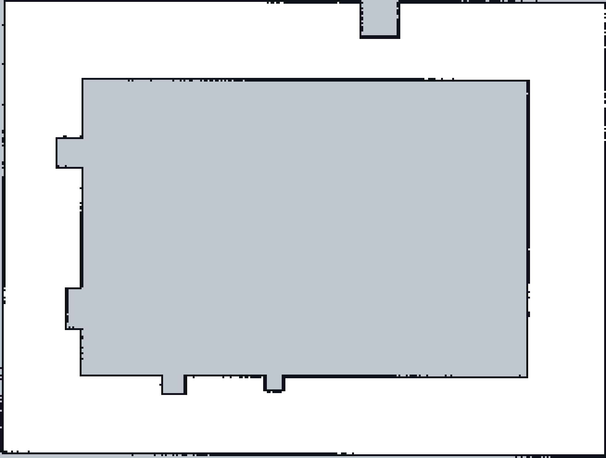
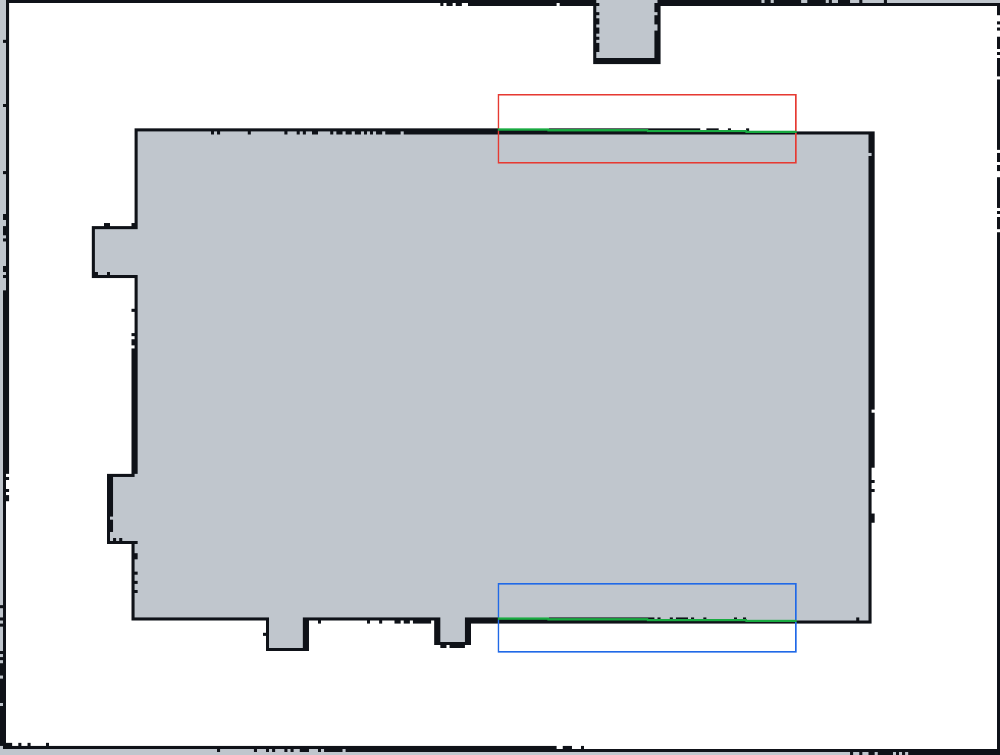
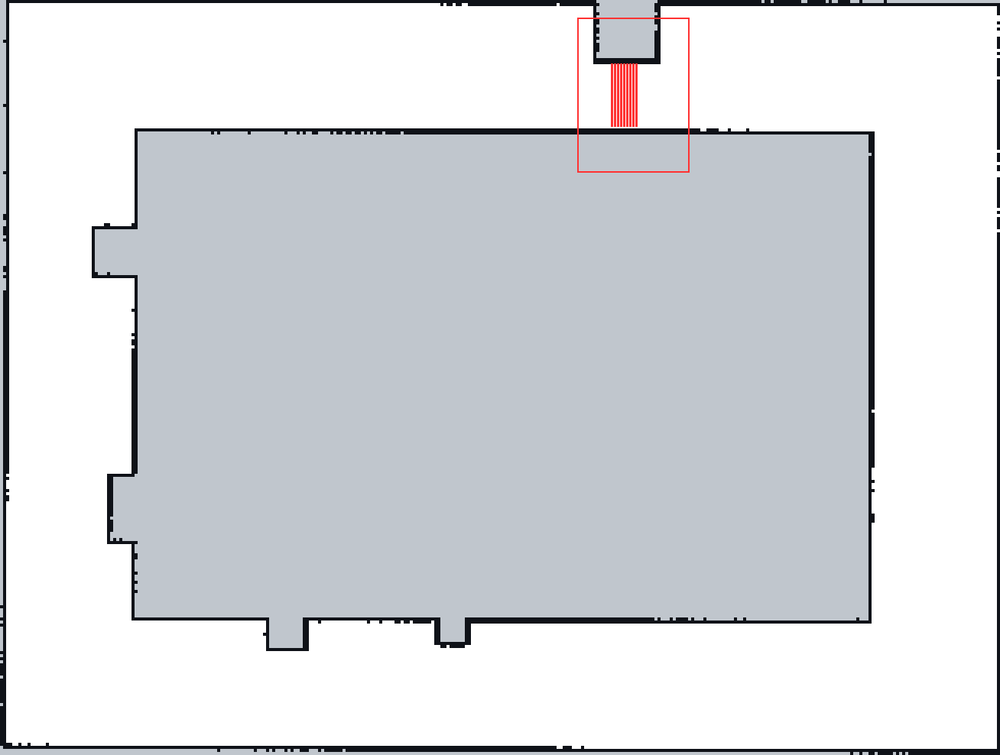

# M3-2 SLAM 地图质量报告

> 来源：`maps/map.pgm` 和 `maps/map.yaml`；通过 `scripts/eval_map.py` 进行可复现的栅格测量。  
> 本报告只评估**最终地图**，不使用 Gazebo 模型真值修正 SLAM 地图。

## 1. 建图结果和可视化

- 地图尺寸：**327 × 247 像素**，分辨率 **0.050 m/像素**。
- 覆盖范围：**16.35 × 12.35 m**。
- 已知自由栅格：**38358**（47.5%）；占据栅格：**2864**（3.5%）；未知栅格：**39547**（49.0%）。



## 2. 第一组证据：墙体直线度

在中央大型障碍物的北、南两段长直墙上，按列提取黑色墙线中点，做最小二乘直线拟合，并计算**每个采样点到拟合直线的距离**。

| 样本区域 | 采样列数 | 拟合长度 | 平均绝对偏差 | 最大绝对偏差 |
|---|---:|---:|---:|---:|
| 中央北墙 | 98 | 4.85 m | 0.006 m | 0.016 m |
| 中央南墙 | 98 | 4.85 m | 0.006 m | 0.020 m |



说明：偏差是**相对于最终地图拟合直线**的误差，并非与 Gazebo 真实墙坐标对比，也不能据此推算实际建图绝对误差。地图分辨率为 5 cm，像素量化影响必须考虑。

## 3. 第二组证据：回环一致性

- 驾驶程序运行日志中已经出现“**已完成一圈巡场路线**”，满足路线返回起始区域的要求。
- 在本报告采样的两段长墙 ROI 中，存在间距至少 3 个像素的分离占据条带的列数：**北墙 0 列、南墙 0 列**。这是对**局部双墙重影的筛查**，不是完整场景的回环优化验证。
- **尚无回环优化次数、回环约束日志，也无同一面墙在建图前后两次观测的独立测量数据。** 因而不能声称已经量化“回环修正量”或“回环前后墙间距”。

要完成更强的回环证据，应在下一次 rosbag 录制过程中保存对应 SLAM 日志或轨迹数据，并保留回环前/后的可对照证据。**不能从最终单张地图臆造该数值。**

## 4. 第三组证据：地图可用性

- 北侧窄通道局部连续自由空间：**21–21 格**，其中最窄测值 **1.05 m**，均基于地图中灰白分割后的白色自由栅格。
- 自由栅格的四邻域连通块：**1 个**，最大连通块占自由栅格 **100.0%**。
- 窄通道至少保留多个自由栅格宽度，但**最终能否用于导航还需要 M3-3 的实际车体 footprint 和代价地图膨胀半径验证**；不能只凭几何连通性断言必然可通行。



## 5. 实验参数和完整性说明

- SLAM 来源：`/scan`、`/odom` 和相应 TF；`/gazebo/model_states` **不得用于地图修正**。
- 分辨率：0.05 m/像素；具体参数含义和配置理由以 `config/slam_params.yaml` 注释为准，提交前仍需核对该文件。
- `maps/map.yaml` 保存器生成的 `free_thresh` 为 **0.25**、`occupied_thresh` 为 **0.65**；这两个值是当前实际交付文件中的值。
- rosbag：**本报告没有假定已经存在**。若 `bags/` 为空，仍需真实录制 `/scan`、`/odom`、`/tf`、`/tf_static` 和时钟相关数据，不能用日志伪装 rosbag。
- 回环开关对比实验为选做，`maps/map_with_loop_off.pgm` **只有真正重新建图后才能提交**，不能复制现有地图冒充。

## 6. 复现方式

在 ROS 2 环境、项目 M3 目录下执行：

```bash
python3 M3-2/scripts/eval_map.py
```

脚本生成 `results/quality_metrics.json` 和三张 PNG。如果手动修改过此报告，脚本默认**不会覆盖**它；使用 `--overwrite-report` 才会重新生成。
